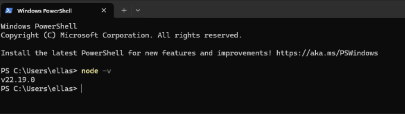

# Activity 0

- Author: Daniel Hanson
- Date: 9/7/2025

## Introduction

- This is **activity 0** uses the tools below to create a Hello World project.
     - Express
     - NodeJS
     - Visual studio code
     - TypeScript

## Screenshots

- 1a) Checking the node version installed on local device.

 

- 1b) Checking the NPM version installed on local device.

In the screenshots above, I installed NodeJS and NPM. Then I checked in the terminal if they were installed by checking the version.

  

- 1c) Running the app.js in the terminal.

 

I created a .js file called app which console prints Hello World to the console. Then I saved it in a folder called hello. I opened a terminal and changed directory into the hello folder and ran the app.js by typing in “node app.js.” This returned the code to the terminal. 

  

- 1d) Accessing localhost view

 

- 1d) Accessing console view

 

I started a local server to view on my local host the javascript code being printed to the page as a response. I created an app.js file then ran the commands in the terminal “npm init, npm install express.” 
To start the NodeJS server I ran “node app.js.” Then I stopped the server with CTRL + C. 

  

- 1e) Changed response string.

 

Using Nodemon saves time from having to type CTRL + C to stop and node app.js to run the server every time you need to edit your code. 

  

- 1f) Ran "app.ts".

 

I created a simple TypeScript project that runs in the web browser.  

  

- 1g) App.ts commented code.

 

I setup a Node.js project with TypeScript. First I created a new project folder MusicAPI and initialized it with npm init. Next, I installed Express and its TypeScript type definitions. Then I installed TypeScript as a development tool and generated a tsconfig.json file. The src folder was created to store the source code called app.ts containing an Express app. The single route / responds with the Hello world welcome text. The ts-node directly compiled and ran the TypeScript file without building it first. 

## Conclusion

- I learned how to install NodeJS, Express, VS Code, and TypeScript.
     - The 3 applications created were a NodeJS, Express, and TypeScript applications.