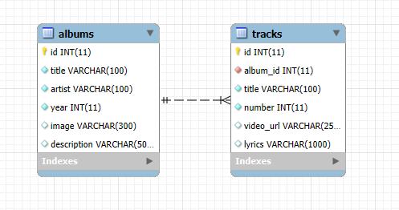
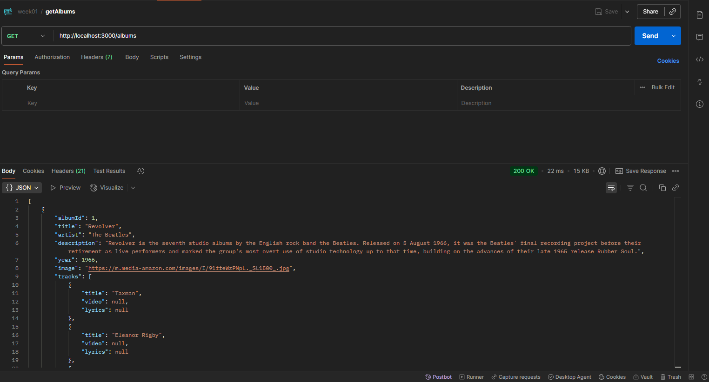
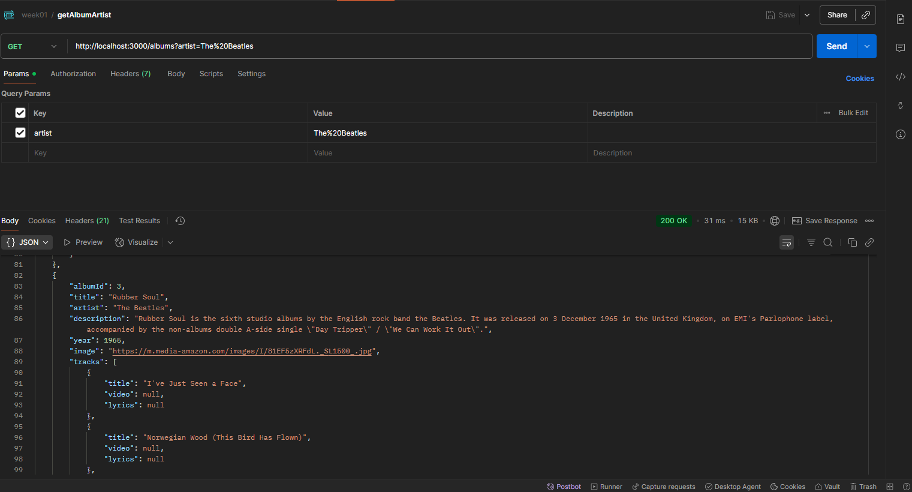
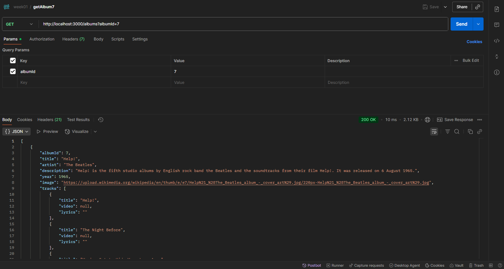
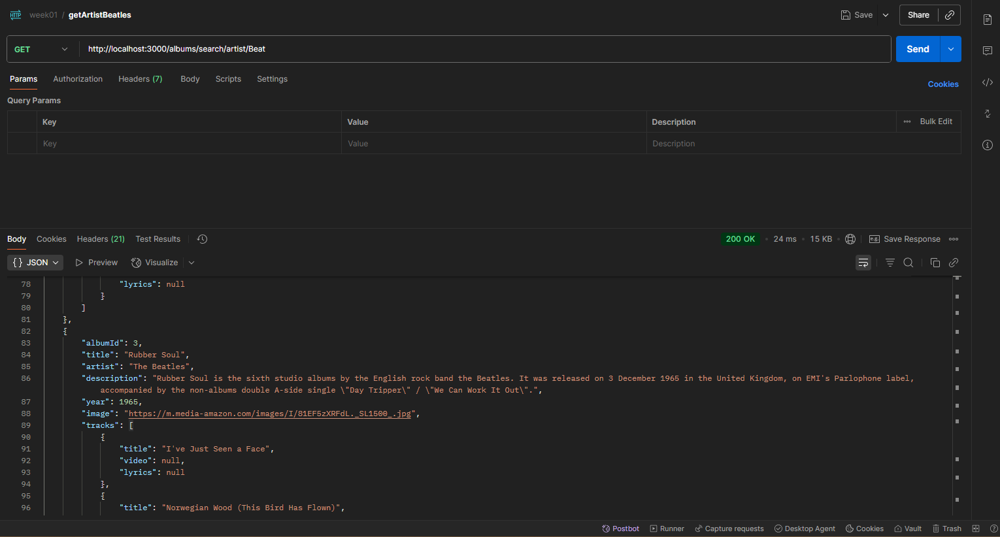
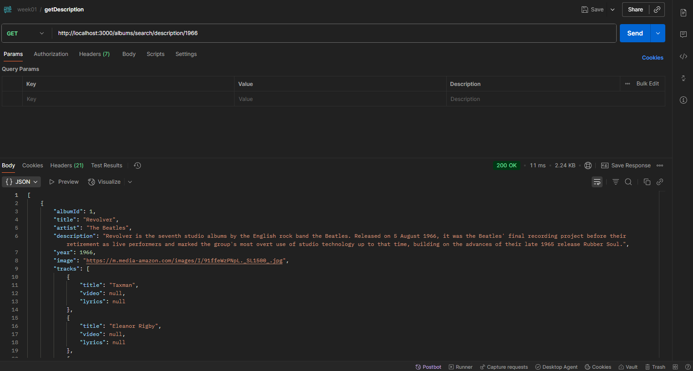
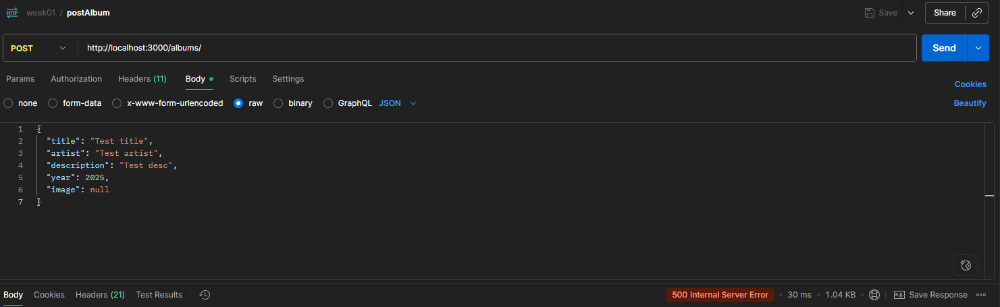
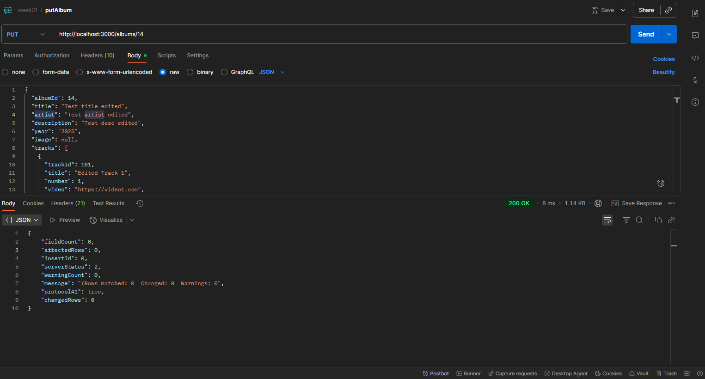
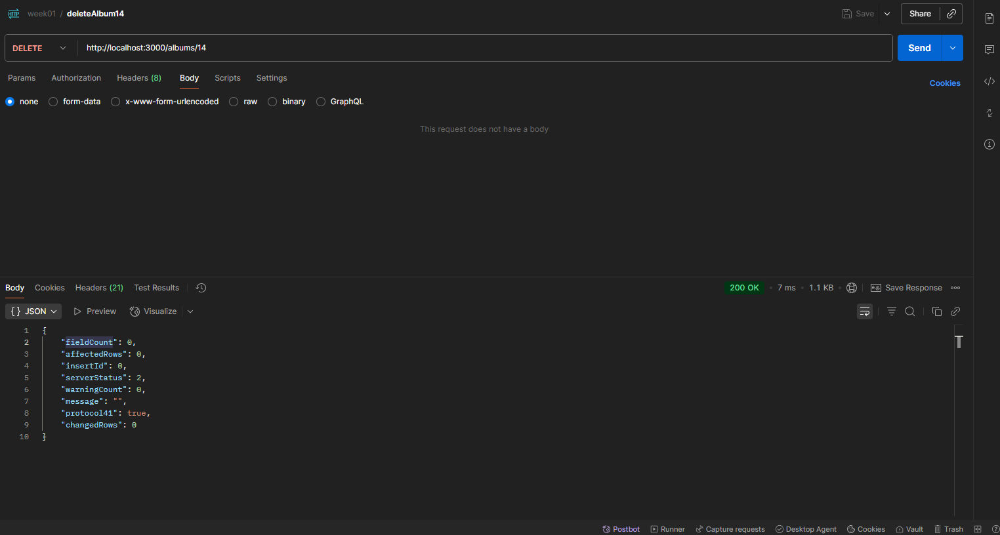
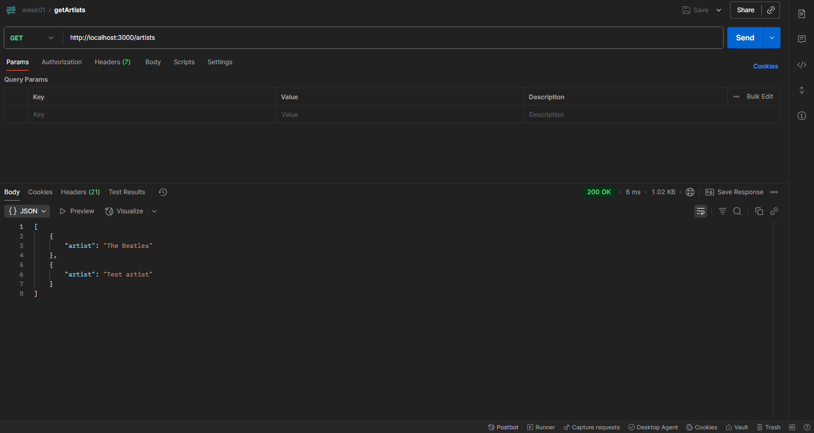

# Activity 1

- Author: Daniel Hanson
- Date: 9/7/2025


## Introduction
In this assignment, we are building a Music API using **Node.js**, **Express**, and **Typescript**. This API lets clients like a web app interact with a MySQL database.


The API follows the REST style which means we use the common HTTP methods like GET, POST, PUT, and DELETE. 


## Summary
The code is organized by the MVC pattern.
- **Model/DAO**: Talks to the MySQL database and runs queries.
- **Controller**: Contains the logic. 
     - (Example: handling requests to find albums by artist or update an album) 
- **Router**: Connects HTTP endpionts like /album/:id to the right controller methods.


## Recordings
- [Testing all 9 API entry points](https://www.loom.com/share/0125b964ae844a6e917867aa6a70eaeb?sid=6c158745-390b-4381-b422-98535c56726d)
- [Drill down into the details of one API method.](https://www.loom.com/share/ab28978b9eff4442a2b27fbf7a9d8170?sid=4d5baaf6-14db-4425-9ae4-4f1944dd93e1)


## Environmental Variables
- [.env File](../../part3/MusicAPI/.env)
- MySQL Database variables below:
```
#MySQL Settings
MY_SQL_DB_HOST=127.0.0.1
MY_SQL_DB_USER=root
MY_SQL_DB_PASSWORD=root
MY_SQL_DB_PORT=3306
MY_SQL_DB_DATABASE=music
MY_SQL_DB_CONNECTION_LIMIT=10


#Server Settings

PORT=5000
NODE_ENV=development
GREETING=Hello from the environment file. Be kind to the environment! 
```

## Database Initialization
- Open and start MySQL workbench.
- Copy the initialization file and paste into a query.
- Run the query to create the database.


## Activity 1 Commands
```
cd ~/git/cst391/activities/activity1/part3/MusicAPI

# Automatically restarts the Node.js server when file changes are detected
npm install -g nodemon

# Loads environment variables from a .env file into process.env
npm install dotenv

# Enables Cross-Origin Resource Sharing, allowing  API to accept requests from different domains
npm install cors

# Adds security-related HTTP headers to protect your Express app
npm install helmet

# MySQL client for Node.js to connect and query a MySQL database
npm install mysql

# Generates unique IDs, often used for request tracking or identifiers
npm install uuid

# Type definitions for CORS (for TypeScript projects)
npm install @types/cors --save-dev

# Type definitions for Dotenv (for TypeScript projects)
npm install @types/dotenv --save-dev

# Type definitions for MySQL (for TypeScript projects)
npm install @types/mysql --save-dev

# Type definitions for UUID (for TypeScript projects)
npm install @types/uuid --save-dev

# Local Nodemon install for development (saves to devDependencies)
npm install nodemon --save-dev

# TS-Node: allows running TypeScript files directly without compiling to JavaScript first
npm install ts-node --save-dev

# Run script to start server
npm start

```


## Database 

- Database Schema


## Postman Test Links
- getAlbums

     http://localhost:3000/albums


- getAlbumArtist

     http://localhost:3000/albums?artist=The%20Beatles


- getAlbum7

    http://localhost:3000/albums?albumId=7 


- getArtistBeatles

     http://localhost:3000/albums/search/artist/Beat


- getDescription

     http://localhost:3000/albums/search/description/1966


- postAlbum

     http://localhost:3000/albums/


- putAlbum

     http://localhost:3000/albums/14


- deleteAlbum14

     http://localhost:3000/albums/15


- getArtists

     http://localhost:3000/artists
     

## Conclusion
- I learned how to structure an Express API project with TypeScript.
- See how the routes, controllers, anda database queries work together.
- Learned how to use Postman to test RESTful endpoints. 
- Acquired hands on expereince with middleware, logging, and database integration.


