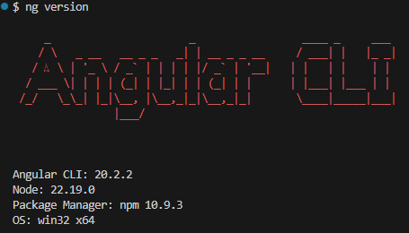
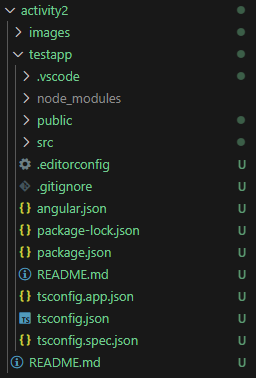
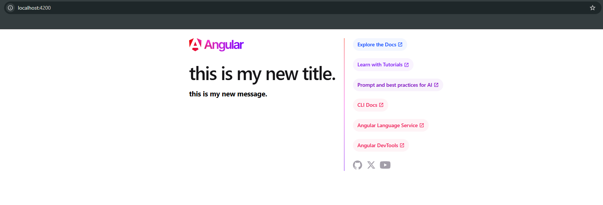

# Activity 2

- Author: Daniel Hanson
- Date: 9/14/2025

## Introduction


## Activity 2 Commands
```
npm install -g @angular/cli
```
- Install Angular CLI globally on your machine


```
ng version
```
- Verify the Angular version installed

    
    - Screenshot of current version


```
ng new testapp
```
- Generate a testapp folder with everything inside it.

    
    - Test folder generated



- Running the testapp

## Research

- **node_modules:**
     - Contain the npm packages and dependencies for the project to compile and run.


- **src/:** 
     - Source folder for the application. Contains the code, templates, and styles that you write for the app. 


- **src/app/:**
     - Holds the main application logic and structure. (.ts, .html, and .css files)


- **src/assets/:**
     - Folder for static assets like images, fonts, and icons.


- **src/environments/:**
     - Lets you define different settings for development and production.


- **main.ts**:
     - Entry point, bootstraps the root component and starts the Angular app.


- **app.component.css**:
     - Defines CSS styles that apply to AppComponent


- **app.component.html**:
     - Contains HTML structure for component which Angular renders in the DOM


- **app.component.ts**:
     - Contains logic, properties, and methods for the component. 


- **app.module.ts**:
     - Declares components, imports Angular modules, and services needed for app.


## Conclusion

In this assignment, we went over the structure and functionality of a basic Angular project. I learned how Angular organizes files and folders to separate the application logic, templates, styles, and assets. This makes it more modular. This excercise teaches the foundation for building and managing Angular applications. 