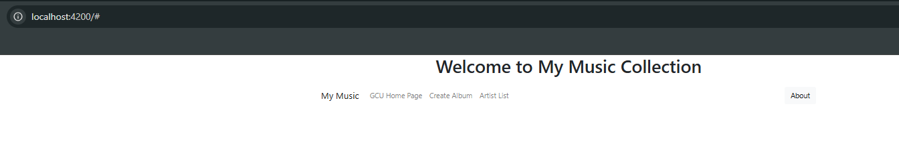
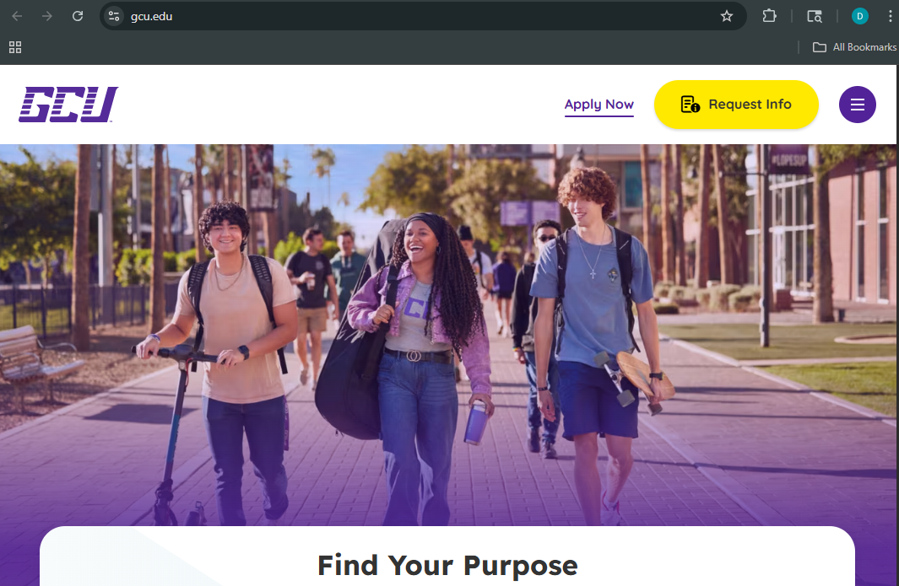
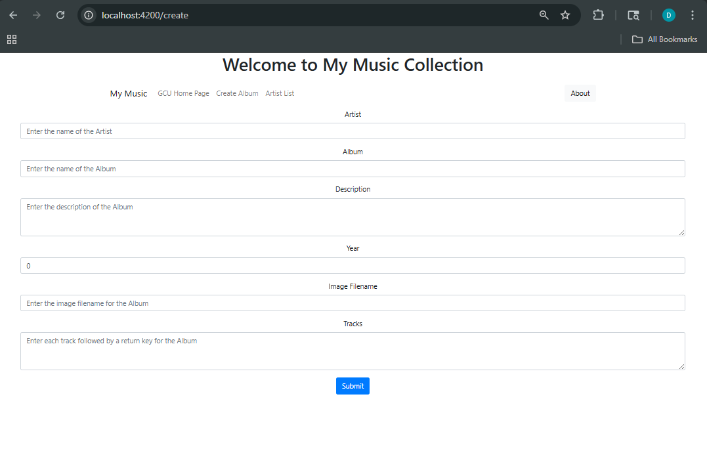
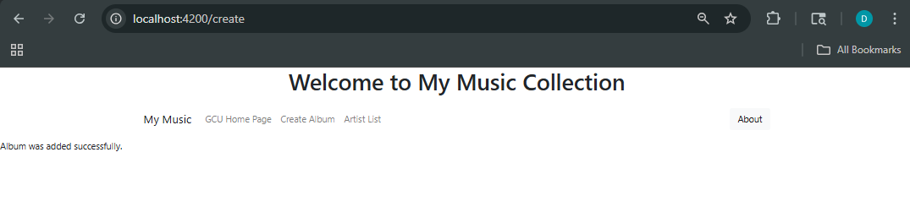
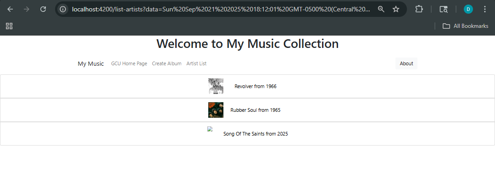
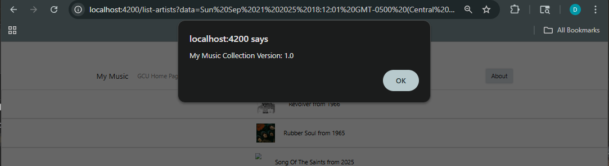

# Activity 3

- Author:  Daniel Hanson
- Date:  9/21/2025

## Introduction

- In this assignment, we built the front end of a music app using Angular. The goal was to build an application that connects to a music API but for this part, we used mock data to design and test the interface. The project helped give practice with Angular concepts like generating components, setting up routing, binding data to templates, and handling user events. We also added bootstrap for styling so the application would look better. 
- The assignment guided us through creating components for listing artists and albums, details, and add/edit/delete options for albums. We also built a nav bar to help users move between the app. Models and music service worked as a middle layer to access the mock data. The app could show artists and albums and navigation.

## Links

- [Activity 3 - Part 1](../simpleapp/README.md): Basic Angular Components, Events, Routes, and Data Binding
- [sample-music-data.json](./src/data/sample-music-data.json)
 
## Music App Deliverables

Captioned screenshots with explanations of each page

- The initial application page

        This page displays the welcome message and navigation bar. Users can move to different parts of the application.

- GCU homepage

When the GCU Homepage link was clicked in the nav bar, the application redirected to GCU's main website.

- Create Album page

This page allowed users to add a new album by entering details like the artist, album, description, year, image, and tracks. You can submit the new album to the mock data collection.

- Artist List page showing your added album/artist

This page displayed the confirmation that an album was added and the other page displays the artist from the mock data. 

- About Box

When the about box option is clicked, a pop up box appears showing the version of the application (1.0). 

## Conclusion

In this assignment, we built the front end of the music app using Angular. We created components to manage the artists and albums, setup navigation with routing, and connected mock data through a music service. The navigation bar gave access to pages like creating albums, viewing artists, and checking the about box. The app was able to display data and accept new entries.

## Troubleshooting

|Issue|Solution|
|--|--|
|ng new simpleapp --no-standalone|- Angular 17, when creating a new application without standalone requires the "--no-standalone" option to access the app.module.ts file|
     
