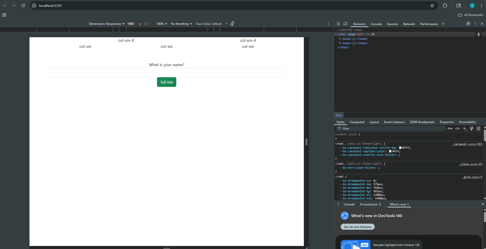
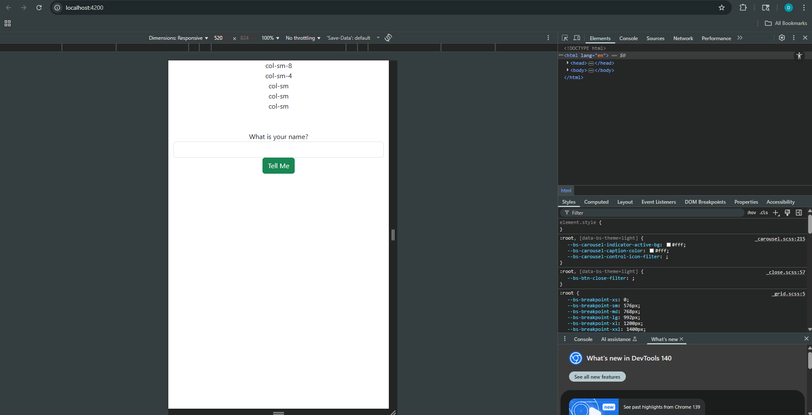
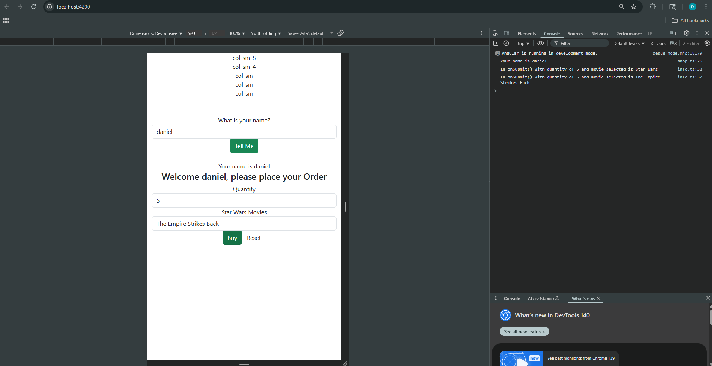

# Simpleapp

This project was generated using [Angular CLI](https://github.com/angular/angular-cli) version 19.2.3.

## Development server

To start a local development server, run:

```bash
ng serve
```

Once the server is running, open your browser and navigate to `http://localhost:4200/`. The application will automatically reload whenever you modify any of the source files.

## Code scaffolding

Angular CLI includes powerful code scaffolding tools. To generate a new component, run:

```bash
ng generate component component-name
```

For a complete list of available schematics (such as `components`, `directives`, or `pipes`), run:

```bash
ng generate --help
```

## Building

To build the project run:

```bash
ng build
```

This will compile your project and store the build artifacts in the `dist/` directory. By default, the production build optimizes your application for performance and speed.

## Running unit tests

To execute unit tests with the [Karma](https://karma-runner.github.io) test runner, use the following command:

```bash
ng test
```

## Running end-to-end tests

For end-to-end (e2e) testing, run:

```bash
ng e2e
```

Angular CLI does not come with an end-to-end testing framework by default. You can choose one that suits your needs.

## Screenshots

- Responsive grid for large resolutions:


  
- Responsive grid for mobile device resolutions:



# Research

## 1. `@Input` Decorator in `info.component.ts`
- The `@Input` decorator allows a parent component like `ShopComponent` to pass data into a child component like `InfoComponent`.  
- In the app, `@Input() name!: string;` in `InfoComponent` lets the parent pass the user's name so the InfoComponent can display a personalized welcome message:  
  ```ts
  Welcome {{name}}, please place your Order

## 2. `[value]` in `info.component.html`
- `[value]` is used to bind a component property to the HTML element’s value.  
- In the Star Wars dropdown:
  ```html
  <option *ngFor="let product of products" [value]="product">{{product}}</option>


## 3. `[(ngModel)]` in `info.component.html`
- `[(ngModel)]` is used for two-way data binding between a component property and a form element.  
- Example with the quantity input:
  ```html
  <input type="text" class="form-control" [(ngModel)]="quantity" name="quantity">
- Typing a number in the input automatically updates the quantity property.

## App in Use

- Console feedback after clicking buy:



## Additional Resources

For more information on using the Angular CLI, including detailed command references, visit the [Angular CLI Overview and Command Reference](https://angular.dev/tools/cli) page.
