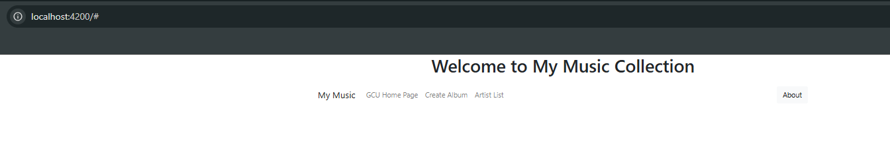
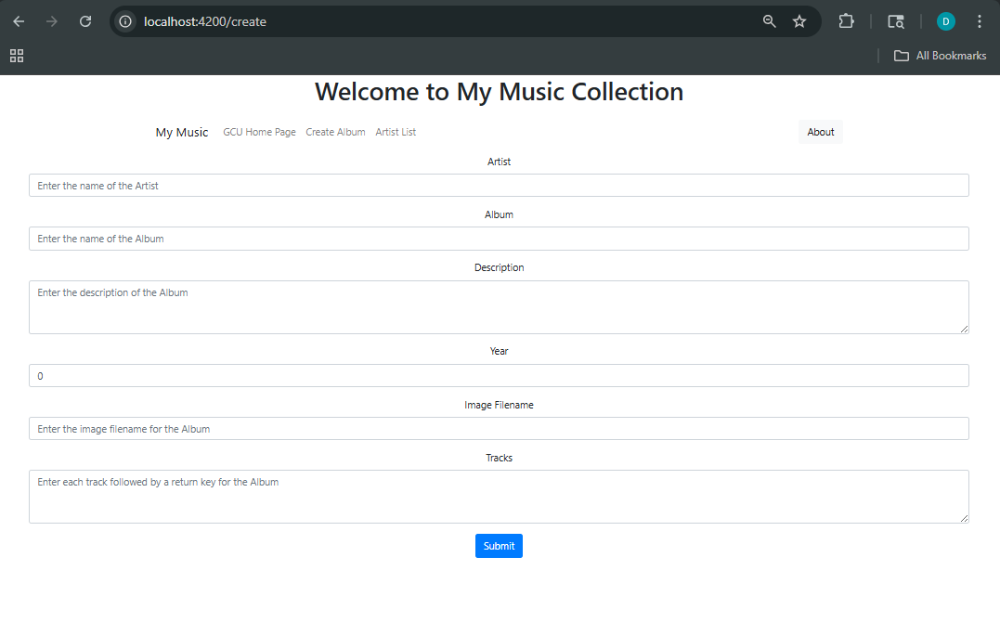
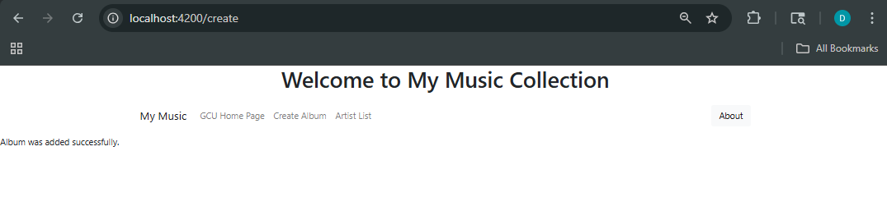
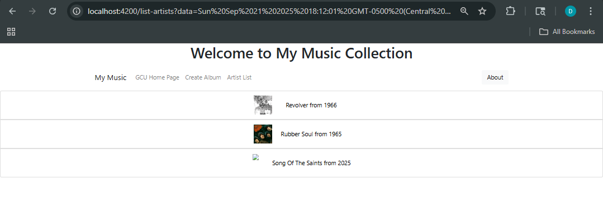
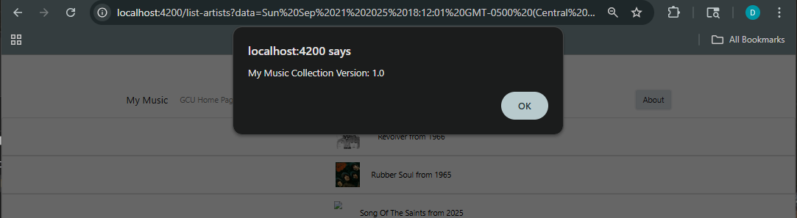

# Activity 4

- Author:  Daniel Hanson
- Date:  9/28/25

## Introduction

- In this assignment, we completed the Music Application by integrating the Angular front-end with the Express back-end services that were created earlier in the course. The main goal was to remove the hard coded data used in the front-end and and replace it with data from the MusicAPI server running. We added the Angular HttpClientModule, refactored the music-service.service.ts to make HTTP requests, and updated the components to handle asynchronous responses through callbacks. At the end, the music application displayed real data for artists, albums, tracks, and supported adding, editing, and deleting albums. 

## Activity 4 Commands

```
npm install
npm install -g @angular/cli --latest
npm install jquery --save-dev
npm install bootstrap
npm install @popperjs/core
ng version
ng serve
```

## sample-music-data.json

- [sample-music-data.json](./src/data/sample-music-data.json)
 
## Test Links

- http://localhost:4200

## Research

- **Question:** How does an Angular application keep a user logged in, and how does it send this information to the server?

- **Answer**: Angular keeps a user logged in by storing a token or session ID in the browser (like in localStorage or cookies) after the user logs in. For each request to the server, Angular sends this token so the server knows the user is authenticated. This way, the app remembers the logged-in state across pages and refreshes.

## Screenshots

- The initial application page

This shows the main landing page of the Angular music application after starting the server. 


- GCU homepage

This screenshot shows the Grand Canyon University (GCU) homepage, which is linked from the Music Application’s navigation bar under “GCU Home Page.” Clicking this link opens the university’s official website in a new browser tab.


- Create Album page

This screenshot displays the Angular Music Application’s form for adding a new album. Users can enter album details such as artist, title, release year, and tracks, and submit the form to add the album to the live MusicAPI database.

- Artist List page showing your added album/artist


This page displayed the confirmation that an album was added and the other page displays the artist from the mock data. 

- About Box

This screenshot shows the “About” section of the Music Application, which displays the application version when the user clicks the corresponding button in the navigation bar.


## Troubleshooting

|Issue|Solution|
|--|--|
|ng new simpleapp --no-standalone|- Angular 17, when creating a new application without standalone requires the "--no-standalone" option to access the app.module.ts file|

## Conclusion

- In summary, Activity 4 showed how the Angular front end and Express back end can work toegether to create a dynamic music application. By connecting the MusicAPI server, the app retrieves real data for artists, albums, and tracks. It fully supports adding, updating, and deleting albums. This integration highlighted the use of HttpClient, asynchronous data handling, and the practical workflow of building a responsive, data-driven web application. 
     