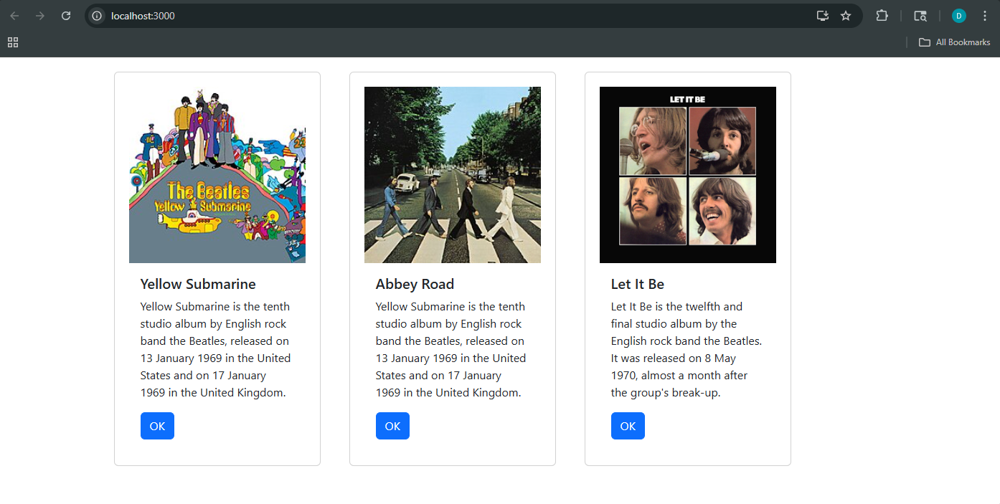

# Activity 5 React Music App

- Author:  Daniel Hanson
- Date:  5 October 2025

## Activities

- [State Changer](../statechanger/README.md)


## Introduction

- Part 1: React Music App – Introduction
    - In Part 1 of the React Music App, I learned the basics of building a React project from scratch using the Create React App tool. I started by setting up the React environment, deleting the default files, and creating a custom index.js file to render content using ReactDOM. I added JSX code to display album details and styled the page with Bootstrap. I also created a reusable Card that used props to display different album information. (like title, image, and description) This part taught how React components, JSX, and props work together to make dynamic, reusable web pages.   

- Part 2: React Music App – Introduction
    - In Part 2 of the React Music App, I learned how to improve how the app handles and organizes data. I created a separate App.js file to manage the main structure of the application, keeping the code more organized and following React’s practices. I learned how to render multiple components efficiently and make the app more flexible by passing props between them. This part reinforced the importance of component reusability and how separating files helps maintain cleaner and more scalable React projects.

## Test Links

- http://localhost:3000
- https://getbootstrap.com/docs/5.3/components/card/
- https://www.bootstrapcdn.com/

## Activity 5 Commands

```
mkdir activity5
cd activity5
npx create-react-app music
cd music/src
rm -rf *
cp ../../../../docs/topic05/index.js .
npm i bootstrap
```

## Activity 5 Example


- The homepage displays 3 music album cards from the Beatles created from a reusable Card component. Each card shows album information passed through React props. The cards display dynamic rendering and component-based design.

## Conclusion

- Part 1: React Music App
  - I learned how to set up a React project and display information using components and JSX. I also practiced adding Bootstrap for styling and using props to pass information between components. This part helped me understand the foundation of React and how to build clean, reusable UI elements.
- Part 2: React Music App
    - I focused on organizing my code and improving the structure of the app by separating components into their own files. I learned how React’s component system makes it easier to manage and update a growing application. This part showed me how to build scalable and maintainable React projects.

## Troubleshooting

|Issue|Solution|
|--|--|
|Changes in index.js or App.js not showing in browser|Save all files and restart the development server using npm start. Sometimes the page needs a manual refresh.|
|Bootstrap styles not showing|Check that the Bootstrap CDN link is correctly added inside the <head> section of public/index.html.|
|Image not displaying|Verify that the image URL is correct and ends with a valid image format (like .jpg or .png).|
