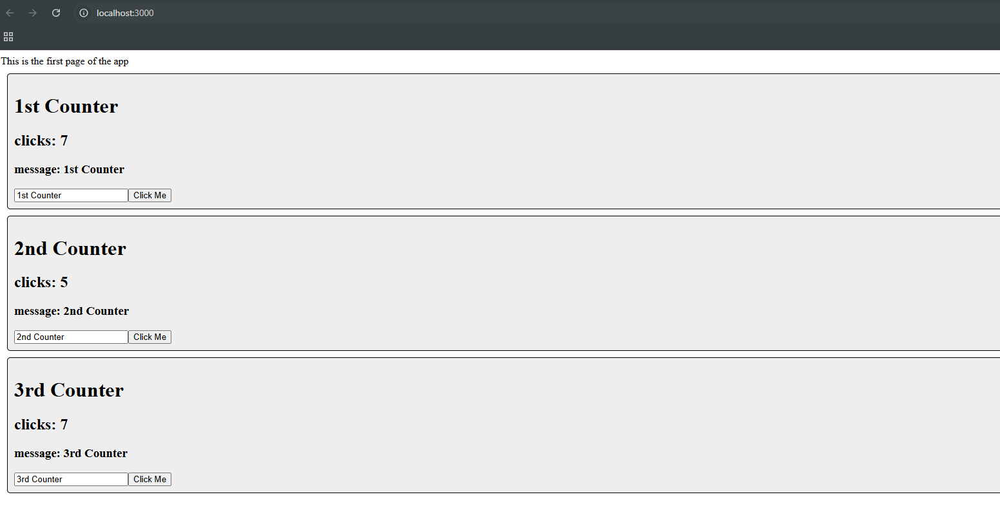

# Activity 5 State Changer Demo

- Author:  Daniel Hanson
- Date:  5 October 2025

## Activities

- [Part 1: React Music Application](../music/README.md)


## Introduction
- In the State Changer Demo, I learned how to use state in React to make a page respond to user actions. I created a simple interactive app where clicking a button or performing an action changes the displayed state on the screen. This demonstrated how React’s useState hook updates the interface when values change. Through this exercise, I learned how React manages data flow and dynamic content using state.

## Test Links

- http://localhost:3000

## Activity 5 Commands

```
npx create-react-app statechanger
npm install
npm start
```

## Activity 5 Example


- Demonstrates how React’s state works. When the user clicks the button, the message on the page changes instantly, showing how the useState hook updates the UI dynamically.

## Conclusion

- In the State Changer Demo, I learned how to use React’s state to make the webpage interactive and respond to user input. I saw how the useState hook updates the display instantly when data changes. This part taught me how state helps make React applications dynamic and user-friendly.

## Troubleshooting

|Issue|Solution|
|--|--|
|Browser didn’t show updates when clicking the button|Made sure the useState hook was imported from React and that the state update function was called correctly.|
|Page didn’t reload automatically after changes|Stopped and restarted the server with npm start to refresh the local development environment.|
