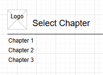

# Milestone 1

- Author: Daniel Hanson
- Date: 9/7/2025
- Project Name: Bible Notebook App

## Introduction

The Bible Notebook App is a web application designed to help users take notes on Bible chapters they read. Users can create, view, edit, and delete notes for different chapters. The app allows users to tag notes, mark favorites, and organize their study efficiently. This application will be built using a MySQL database, Express.js for the back-end, and both Angular and React for the front-end.

## Functionality Requirements

The application must support the following user stories:

- **As a user,** I want to create a notes for a Bible chapter so that I can remember my thoughts.  
- **As a user,** I want to view a list of all my notes so that I can see my study progress.  
- **As a user,** I want to edit a note so that I can update my thoughts or correct mistakes.  
- **As a user,** I want to delete a note so that I can remove unneeded information.  
- **As a user,** I want to search notes by chapter or tags so that I can find specific notes easily.  
- **As a user,** I want to mark notes as favorites so that I can quickly access important notes.

## Initial Database Design

The main entity is **Note** with the following properties:

| Property     | Type        | Description                         |
|-------------|------------|-------------------------------------|
| id          | number     | Primary key                         |
| book        | string     | Bible book (Genesis)
| chapter     | string     | Chapter reference (1)               |
| note_text   | text       | The user's note content             |
| tags        | string     | Optional keywords                   |
| created_at  | datetime   | Timestamp when the note was created |
| favorite    | boolean    | Indicates if the note is important  |


### ER Diagram Placeholder
 

## Initial UI Sitemap

The app will have the following pages:

1. **Home Page:** Displays all notes with search and filter options.  
2. **Create Note Page:** Form to add a new note.  
3. **Edit Note Page:** Edit an existing note.  
4. **Note Details Page:** View full note content.  

### Sitemap Diagram 
```
Home
│
├── Browse Books
│   ├── Select Book
│   │   └── Select Chapter
│   │       └── List Notes
│   │           └── Add/Edit Note
│
├── My Notes
│   ├── All Notes
│   ├── Favorites
│   └── Search Notes
│
├── Settings
│   ├── Theme (Light/Dark)
│   └── Account Info
```

## Initial UI Wireframes

Wireframe sketches showing how the pages will look:

- **Home Page:** List view with note titles, tags, and favorite indicators.  
- **Create/Edit Note Page:** Form with chapter, note text, tags, and favorite checkbox.  
- **Note Details Page:** Full note display with edit and delete buttons.


Home page


Browse books


Select chapter




Notes page


My notes


## Initial UML Classes

The back-end will use these classes:

- **Note**
  - `id: number`
  - `chapter: string`
  - `note_text: string`
  - `tags: string`
  - `created_at: datetime`
  - `favorite: boolean`

- **NoteController**
  - `createNote()`
  - `readNotes()`
  - `updateNote()`
  - `deleteNote()`
  - `searchNotes()`

- **NoteDAO**
  - `createNote()`
  - `getNotes()`
  - `updateNote()`
  - `deleteNote()`
  - `findNotesByChapterOrTag()`

## Risks

Some  risks to track during the project:

- Database connection issues.
- User input validation errors.  
- Handling large text in notes efficiently.  

## Conclusion

This milestone proposal is for the Bible Notebook App. The app will let users take notes on Bible chapters, organize notes with tags, and mark favorites. It includes a database design, a sitemap for navigation, wireframes for the interface, and UML classes for the back-end. This plan will guide the development of the app.
