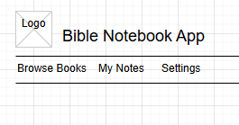
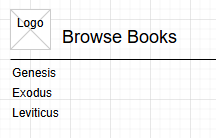
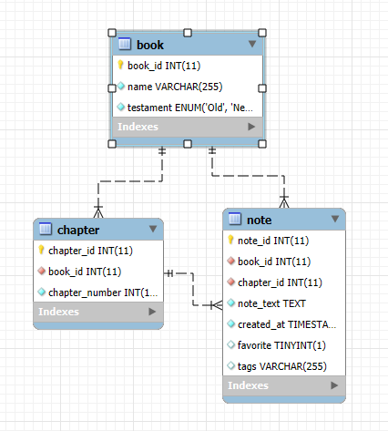

# Milestone 2

- Author: Daniel Hanson
- Date: 9/14/2025

## Instructor feedback 
All requirements were met:
- Markdown usage
- Introduction explaining project proposal
- Listing functional requirements 
- Entity-relationship diagram explaining backend database
- Pages listed in sitemap
- Wireframes of component structure of application
- Class diagram showing classes that will be developed
- Risks about the project were mentioned
- Conclusion wrapped up the page

Response:
- Modified the notes class properties to be more descriptive and updated database design to match.
- Added REST endpoints.
- Added API example API requests.

## Introduction
The Bible Notebook App is a web application designed to help users take notes on Bible chapters and verses they read.  Users can create, view, edit, and delete notes for different chapters. The app allows users to tag notes, and mark favorites. This application will be built using a MySQL database, Express.js for the back-end, and both Angular and React for the front-end.


---

## Functionality Requirements (User Stories)

- **As a user,** I want to create a note for a Bible chapter so that I can remember my thoughts.  
- **As a user,** I want to view a list of all my notes so that I can see my study progress.  
- **As a user,** I want to edit a note so that I can update my thoughts or correct mistakes.  
- **As a user,** I want to delete a note so that I can remove unneeded information.  
- **As a user,** I want to search notes by chapter or tags so that I can find specific notes easily.  
- **As a user,** I want to mark notes as favorites so that I can quickly access important notes.  

---

## Sitemap


The app will have the following pages:

1. **Home Page:** Displays all notes with search and filter options.  
2. **Create Note Page:** Form to add a new note.  
3. **Edit Note Page:** Edit an existing note.  
4. **Note Details Page:** View full note content.  


```
Home
│
├── Browse Books
│   ├── Select Book
│   │   └── Select Chapter
│   │       └── List Notes
│   │           └── Add/Edit Note
│
├── My Notes
│   ├── All Notes
│   ├── Favorites
│   └── Search Notes
│
├── Settings
│   ├── Theme (Light/Dark)
│   └── Account Info
```

## Wireframes

Wireframe sketches showing how the pages will look:

- **Home Page:** List view with note titles, tags, and favorite indicators.  
- **Create/Edit Note Page:** Form with chapter, note text, tags, and favorite checkbox.  
- **Note Details Page:** Full note display with edit and delete buttons.


Home page




Browse books




Select chapter


Notes page


My notes


## Database Design

The main entity is **Note** with the following properties:

| Property     | Type        | Description                         |
|-------------|------------|-------------------------------------|
| id          | number     | Primary key                         |
| book        | string     | Bible book (Genesis)                |
| chapter     | string     | Chapter reference (1)               |
| note_text   | text       | The user's note content             |
| tags        | string     | Optional keywords                   |
| created_at  | datetime   | Timestamp when the note was created |
| favorite    | boolean    | Indicates if the note is important  |


### ER Diagram
 

## UML Class Diagrams (Refined)

- **Note**
  - `id: number`
  - `book: string`
  - `chapter: int`
  - `note_text: string`
  - `tags: string`
  - `created_at: datetime`
  - `favorite: boolean`

- **NoteController**
  - `createNote()`
  - `readNotes()`
  - `updateNote()`
  - `deleteNote()`
  - `searchNotes()`

- **NoteDAO**
  - `createNote()`
  - `getNotes()`
  - `updateNote()`
  - `deleteNote()`
  - `findNotesByChapterOrTag()`


## REST Endpoints
- The Endpoints used in this application follow REST conventions.
- Plural nouns are used as resources.


|Method|Endpoint|Description|
|--|--|--|
|GET|/notes|Retrieve a list of all notes|
|GET|/notes/:id|Retrieve a note by ID|
|POST|/notes|Create a new note|
|PUT|/notes/:id|Update a note by ID|
|DELETE|/notes/:id|Delete a note by ID|
|GET|/books/:bookId/chapters/:chapterId/notes|Retrieve all notes for a chapter|
|GET|/notes/search?tag=prayer|Search notes by a tag|
|GET|/notes/search?chapter=Genesis%2|Search notes by chapter|
|PUT|/notes/:id/favorite|Mark a note as a favorite|
|GET|/notes/favorites|Retrieve all favorite notes|


## API Example API Requests
**GET /notes**
```
Response:
[
    {
        "id": 1,
        "book": "Ephesians",
        "chapter": 5,
        "note_text": "Husbands love your wives as Christ loved the church."
        "tags": ["husband", "love"],
        "created_at": 2025-09-13T10:07:00,
        "favorite": true
    },
    {
        "id": 2,
        "book": "Philippians",
        "chapter": 2,
        "note_text": "Have humility and see others how Christ sees them."
        "tags": ["selflessness", "humility"],
        "created_at": 2025-09-13T10:07:00,
        "favorite": true
    }
]
```

---


**POST /notes** 

```
Request:
{
    "book": "Romans",
    "chapter": 5,
    "note_text": "We are justified by faith in Christ."
    "tags": ["faith", "justification"],
    "created_at": 2025-09-13T10:07:00,
    "favorite": true
}
```


```
Response:
{
    "id": 3,
    "book": "Romans",
    "chapter": 5,
    "note_text": "We are justified by faith in Christ."
    "tags": ["faith", "justification"],
    "created_at": 2025-09-13T10:07:00,
    "favorite": true
}
```
---

**PUT /notes/3**
```
Request:
{
    "book": "Romans",
    "chapter": 5,
    "note_text": "We are justified by faith and have peace with God through Christ."
    "tags": ["faith", "justification", "peace"],
    "created_at": 2025-09-13T10:10:00,
    "favorite": true
}
```

```
Response:
{
    "id": 3,
    "book": "Romans",
    "chapter": 5,
    "note_text": "We are justified by faith and have peace with God through Christ."
    "tags": ["faith", "justification", "peace"],
    "created_at": 2025-09-13T10:10:00,
    "favorite": true
}
```

---

**DELETE /notes/3**

```
Response:
{
    "message": Note with id 3 has been deleted successfully."
}
```


## Risks

- Database connection issues.  
- User input validation errors.  
- Handling large text in notes efficiently.  

## Conclusions
This milestone added to the foundation of the Bible Notebook App by refining the design slightly and adding more detail. 
It added defined REST endpoints with example API requests to support all user stories. These deliverables create a solid blueprint for implementaiton. This app is ready to transition to building and testing core features.

