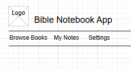

# Milestone 2

- Author: Daniel Hanson
- Date: 9/14/2025

## Instructor feedback 
All requirements were met:
- Markdown usage
- Introduction explaining project proposal
- Listing functional requirements 
- Entity-relationship diagram explaining backend database
- Pages listed in sitemap
- Wireframes of component structure of application
- Class diagram showing classes that will be developed
- Risks about the project were mentioned
- Conclusion wrapped up the page

## Introduction
The Bible Notebook App is a web application designed to help users take notes on Bible chapters and verses they read.  Users can create, view, edit, and delete notes for different chapters. The app allows users to tag notes, and mark favorites. This application will be built using a MySQL database, Express.js for the back-end, and both Angular and React for the front-end.


---

## Functionality Requirements (User Stories)

- **As a user,** I want to create a note for a Bible chapter so that I can remember my thoughts.  
- **As a user,** I want to view a list of all my notes so that I can see my study progress.  
- **As a user,** I want to edit a note so that I can update my thoughts or correct mistakes.  
- **As a user,** I want to delete a note so that I can remove unneeded information.  
- **As a user,** I want to search notes by chapter or tags so that I can find specific notes easily.  
- **As a user,** I want to mark notes as favorites so that I can quickly access important notes.  

---

### Sitemap Diagram 
```
Home
│
├── Browse Books
│   ├── Select Book
│   │   └── Select Chapter
│   │       └── List Notes
│   │           └── Add/Edit Note
│
├── My Notes
│   ├── All Notes
│   ├── Favorites
│   └── Search Notes
│
├── Settings
│   ├── Theme (Light/Dark)
│   └── Account Info
```

## Wireframes

Wireframe sketches showing how the pages will look:

- **Home Page:** List view with note titles, tags, and favorite indicators.  
- **Create/Edit Note Page:** Form with chapter, note text, tags, and favorite checkbox.  
- **Note Details Page:** Full note display with edit and delete buttons.


Home page




Browse books


Select chapter


Notes page


My notes


## Database Design


## Class Diagrams


## REST Endpoints


## API Example API Requests


## Conclusions

