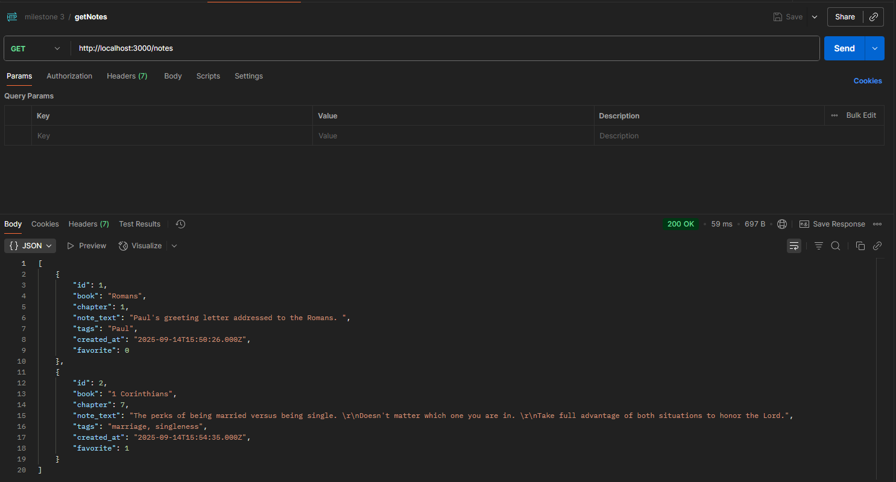
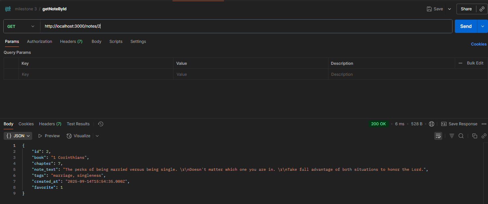
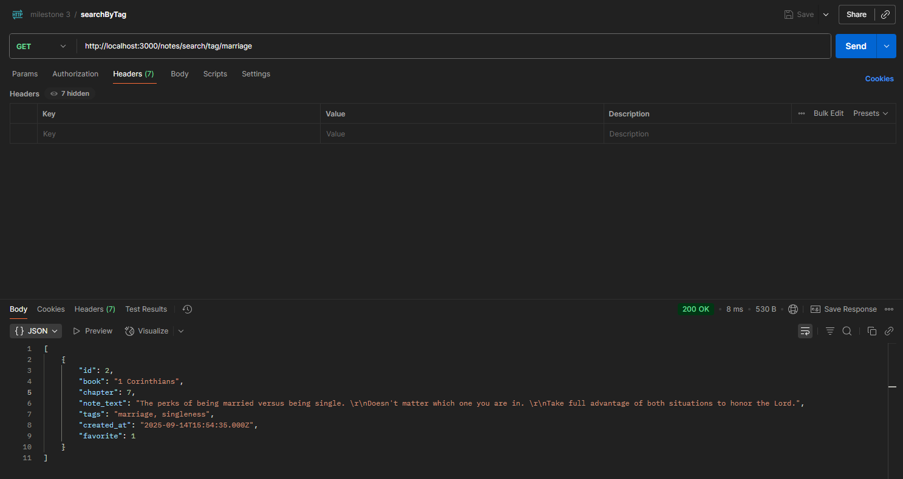
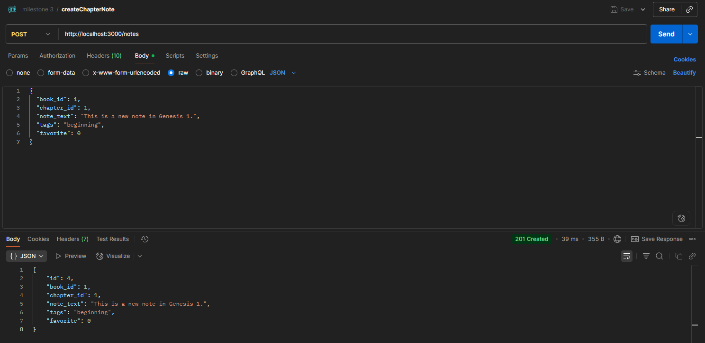
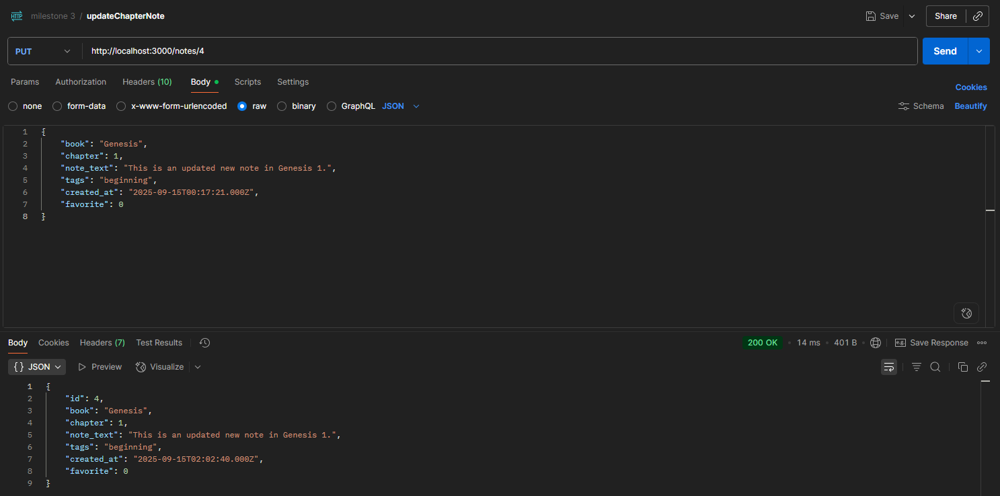
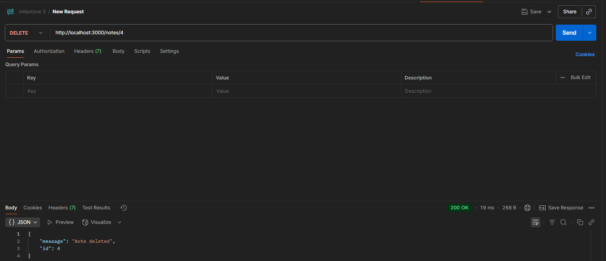
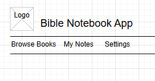
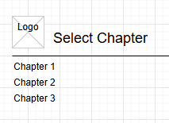
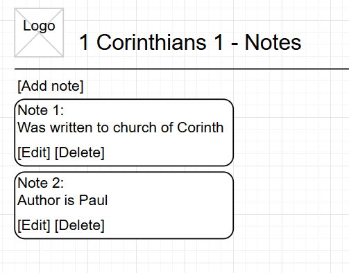
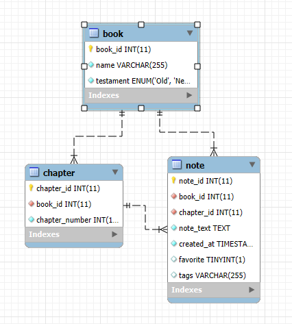

# Milestone 4

- Author: Daniel Hanson
- Date: 9/28/2025

## Recordings
- [Link to powerpoint video]
- [Link to UI screencast](https://www.loom.com/share/ec1732572e6c4ef89b9c66070b36ce4b?sid=03afd3d6-816c-4f66-b505-bb4da53113d7)
  
## Introduction
This milestone focuses on building a web application that works with a REST API to manage "products." The app allows users to create, view, update, and delete products through an easy-to-use web interface. Navigation has been added using a responsive Bootstrap NavBar to make the app more user-friendly.

The report includes updates to the design, a summary of changes and known issues, and documentation of the REST API. It also shows how actions in the web interface affect the backend data, demonstrating the connection between the Angular frontend and the REST API.

## Design Updates

The application design has been updated to improve usability and full integration with the REST API.

- **REST API Integration:** Connected the Angular frontend to the REST API to perform create/read/update/delete operations on notes.  
- **Nav Bar:** Added a responsive bootstrap NavBar to allow easy navigation between the pages.
- **Product Form:** Updated the product form to handle required fields and include validation.

These updates ensure that the frontend and backend work seamlessly, providing a functional and user-friendly experience while maintaining clear and structured code.


## Updates and Known Issues

| Update / Issue                | Description                                                                  | Status                |
|----------------------|-----------------------------------------------------------------------------|--------------------------------------|
| REST API Integration    | Connected the Angular frontend to the backend API to perform Create, Read, Update, and Delete operations on products        | Completed                                 |
| Navigation Bar | Added a responsive Bootstrap NavBar for easier navigation between pages   | Completed                                 |
| Product Form Validation        | Updated the product form to include validation for required fields    | Completed                                 |


## Postman Screenshots

```
http://localhost:3000/notes
```

- List all notes in biblenotebook database.

---
```
http://localhost:3000/notes/2
```

- Retrieve a note by its ID.

---
```
http://localhost:3000/notes/search/tag/marriage
```

- Search notes by tags.

---
```
http://localhost:3000/notes
```

- Create a new chapter note.

---
```
http://localhost:3000/notes/4
```

- Update a note.

---
```
http://localhost:3000/notes/4
```

- Delete a note.


---

## Functionality Requirements (User Stories)

- **As a user,** I want to create a note for a Bible chapter so that I can remember my thoughts.  
- **As a user,** I want to view a list of all my notes so that I can see my study progress.  
- **As a user,** I want to edit a note so that I can update my thoughts or correct mistakes.  
- **As a user,** I want to delete a note so that I can remove unneeded information.  
- **As a user,** I want to search notes by chapter or tags so that I can find specific notes easily.  
- **As a user,** I want to mark notes as favorites so that I can quickly access important notes.  

---

### Sitemap Diagram 
```
Home
│
├── Browse Books
│   ├── Select Book
│   │   └── Select Chapter
│   │       └── List Notes
│   │           └── Add/Edit Note
│
├── My Notes
│   ├── All Notes
│   ├── Favorites
│   └── Search Notes
│
├── Settings
│   ├── Theme (Light/Dark)
│   └── Account Info
```

## Wireframes

Wireframe sketches showing how the pages will look:

- **Home Page:** List view with note titles, tags, and favorite indicators.  
- **Create/Edit Note Page:** Form with chapter, note text, tags, and favorite checkbox.  
- **Note Details Page:** Full note display with edit and delete buttons.


Home page




Browse books


Select chapter




Notes page




My notes


---

## Functionality Requirements (User Stories)

- **As a user,** I want to create a note for a Bible chapter so that I can remember my thoughts.  
- **As a user,** I want to view a list of all my notes so that I can see my study progress.  
- **As a user,** I want to edit a note so that I can update my thoughts or correct mistakes.  
- **As a user,** I want to delete a note so that I can remove unneeded information.  
- **As a user,** I want to search notes by chapter or tags so that I can find specific notes easily.  
- **As a user,** I want to mark notes as favorites so that I can quickly access important notes.  

---

## Sitemap


The app will have the following pages:

1. **Home Page:** Displays all notes with search and filter options.  
2. **Create Note Page:** Form to add a new note.  
3. **Edit Note Page:** Edit an existing note.  
4. **Note Details Page:** View full note content.  


```
Home
│
├── Browse Books
│   ├── Select Book
│   │   └── Select Chapter
│   │       └── List Notes
│   │           └── Add/Edit Note
│
├── My Notes
│   ├── All Notes
│   ├── Favorites
│   └── Search Notes
│
├── Settings
│   ├── Theme (Light/Dark)
│   └── Account Info
```


## Database Design

The main entity is **Note** with the following properties:

| Property     | Type        | Description                         |
|-------------|------------|-------------------------------------|
| id          | number     | Primary key                         |
| book        | string     | Bible book (Genesis)                |
| chapter     | string     | Chapter reference (1)               |
| note_text   | text       | The user's note content             |
| tags        | string     | Optional keywords                   |
| created_at  | datetime   | Timestamp when the note was created |
| favorite    | boolean    | Indicates if the note is important  |


### ER Diagram
 

## UML Class Diagrams (Refined)

- **Note**
  - `id: number`
  - `book: string`
  - `chapter: int`
  - `note_text: string`
  - `tags: string`
  - `created_at: datetime`
  - `favorite: boolean`

- **NoteController**
  - `createNote()`
  - `readNotes()`
  - `updateNote()`
  - `deleteNote()`
  - `searchNotes()`

- **NoteDAO**
  - `createNote()`
  - `getNotes()`
  - `updateNote()`
  - `deleteNote()`
  - `findNotesByChapterOrTag()`


## REST Endpoints
- The Endpoints used in this application follow REST conventions.
- Plural nouns are used as resources.


|Method|Endpoint|Description|
|--|--|--|
|GET|/notes|Retrieve a list of all notes|
|GET|/notes/:id|Retrieve a note by ID|
|POST|/notes|Create a new note|
|PUT|/notes/:id|Update a note by ID|
|DELETE|/notes/:id|Delete a note by ID|
|GET|/books/:bookId/chapters/:chapterId/notes|Retrieve all notes for a chapter|
|GET|/notes/search?tag=prayer|Search notes by a tag|
|GET|/notes/search?chapter=Genesis%2|Search notes by chapter|
|PUT|/notes/:id/favorite|Mark a note as a favorite|
|GET|/notes/favorites|Retrieve all favorite notes|


## API Example API Requests
**GET /notes**
```
Response:
[
    {
        "id": 1,
        "book": "Ephesians",
        "chapter": 5,
        "note_text": "Husbands love your wives as Christ loved the church."
        "tags": ["husband", "love"],
        "created_at": 2025-09-13T10:07:00,
        "favorite": true
    },
    {
        "id": 2,
        "book": "Philippians",
        "chapter": 2,
        "note_text": "Have humility and see others how Christ sees them."
        "tags": ["selflessness", "humility"],
        "created_at": 2025-09-13T10:07:00,
        "favorite": true
    }
]
```

---


**POST /notes** 

```
Request:
{
    "book": "Romans",
    "chapter": 5,
    "note_text": "We are justified by faith in Christ."
    "tags": ["faith", "justification"],
    "created_at": 2025-09-13T10:07:00,
    "favorite": true
}
```


```
Response:
{
    "id": 3,
    "book": "Romans",
    "chapter": 5,
    "note_text": "We are justified by faith in Christ."
    "tags": ["faith", "justification"],
    "created_at": 2025-09-13T10:07:00,
    "favorite": true
}
```
---

**PUT /notes/3**
```
Request:
{
    "book": "Romans",
    "chapter": 5,
    "note_text": "We are justified by faith and have peace with God through Christ."
    "tags": ["faith", "justification", "peace"],
    "created_at": 2025-09-13T10:10:00,
    "favorite": true
}
```

```
Response:
{
    "id": 3,
    "book": "Romans",
    "chapter": 5,
    "note_text": "We are justified by faith and have peace with God through Christ."
    "tags": ["faith", "justification", "peace"],
    "created_at": 2025-09-13T10:10:00,
    "favorite": true
}
```

---

**DELETE /notes/3**

```
Response:
{
    "message": Note with id 3 has been deleted successfully."
}
```


## Risks

- Database connection issues.  
- User input validation errors.  
- Handling large text in notes efficiently.  

## Conclusion
This milestone delivered a working Angular application integrated with a REST API. The system supports all required product operations, including listing, creating, updating, and deleting, while also providing navigation through a Bootstrap-based interface. Key updates such as form validation and error handling improved usability and reliability. Although some minor issues remain, the project demonstrates the ability to design, build, and integrate a full-stack solution. These results provide a strong foundation for future improvements and enhancements.
